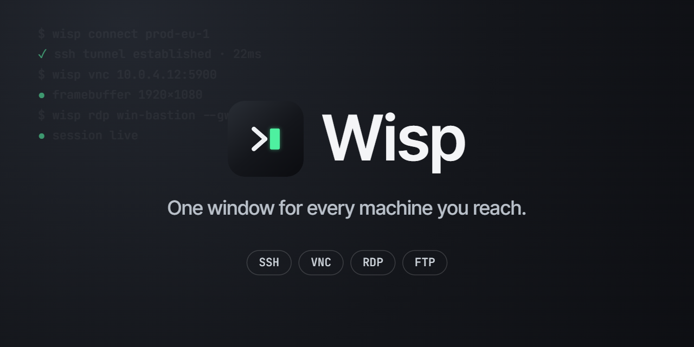

# Wisp

A small, secure SSH/SFTP/VNC desktop client built with Tauri v2 and React.

Features:

- SSH terminal sessions (xterm.js) with tabs and split panes
- Saved profiles and groups, custom icons, and `~/.ssh/config` + PuTTY `.ppk` import
- SFTP file browser with uploads and downloads
- Local, remote, and dynamic (SOCKS) port forwarding, plus jump hosts
- Host-key trust-on-first-use, encrypted secret vault, and themeable appearance

## Develop

```sh
bun install
bun run tauri dev
```

## Test

```sh
bun run test:run                                   # frontend (vitest)
cargo test --manifest-path src-tauri/Cargo.toml    # backend (Rust)
```

`bun run lint` runs Biome over `src`. The Rust IPC layer generates `src/bindings.ts`;
regenerate it with `cargo test --manifest-path src-tauri/Cargo.toml export_bindings`.
